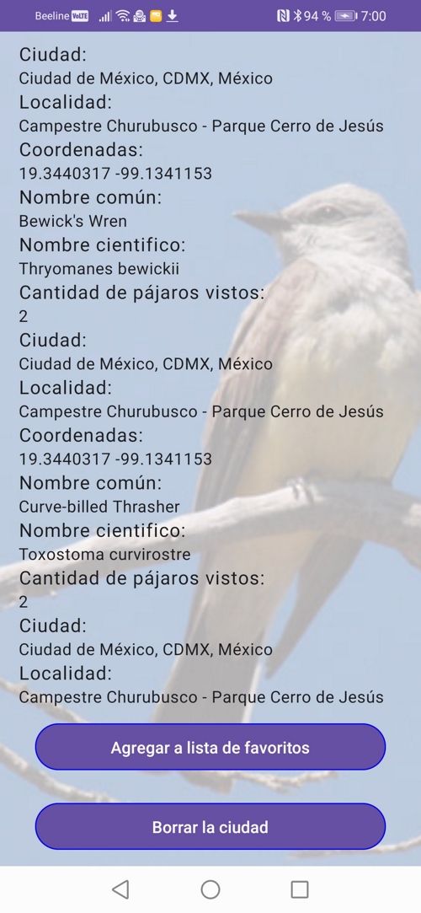
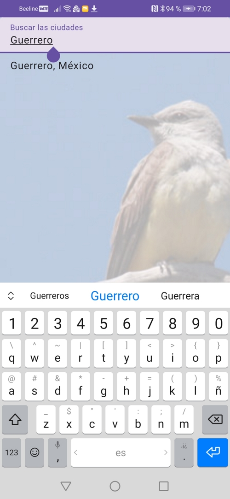

# Quetzalcoatl Sistemas tarea de prueba

#### Description
Tarea de prueba Android para Quetzalcóatl Sistemas

#### Software Architecture
1. Usando arquitectura MVVM y Material Design. Usando puro SQLite sin librerías (Room, Realm, etc.) para guardar los datos para uso si dispositivo está offline
2. Usando Dagger, Retrofit2, RxJava
3. También está agregado presentación de la ubicación de la ciudad en el mapa de OpenStreetMap y cargando y presentación de las fotos en pantalla completa de las ciudades de la lista de usuario en el fondo detrás, las fotos son descargadas desde Google Images

#### Instructions
1. El archivo res/raw/config.json contiene la configuración inicial cual contiene el API Key para OpenWeatherMap servicio y la lista inicial de las ciudades guardados
2. Para borrar la ciudad desde lista es necesario a mover en su página de detalles de clima y pulsar botón X a la derecha abajo
3. La aplicación va a mostrar la información guardada desde su base de datos local si dispositivo está offline y va a mostrar los errores de texto sobre conexión perdido a Internet también

#### Important!
Las fotos de ciudades en el fondo son descargadas desde servicio de Google Images con limita hasta 100 solicitudes por día, y así estas fotos pueden parar cargando hasta día próximo si la aplicación está usado intensivamente

#### Screenshots

