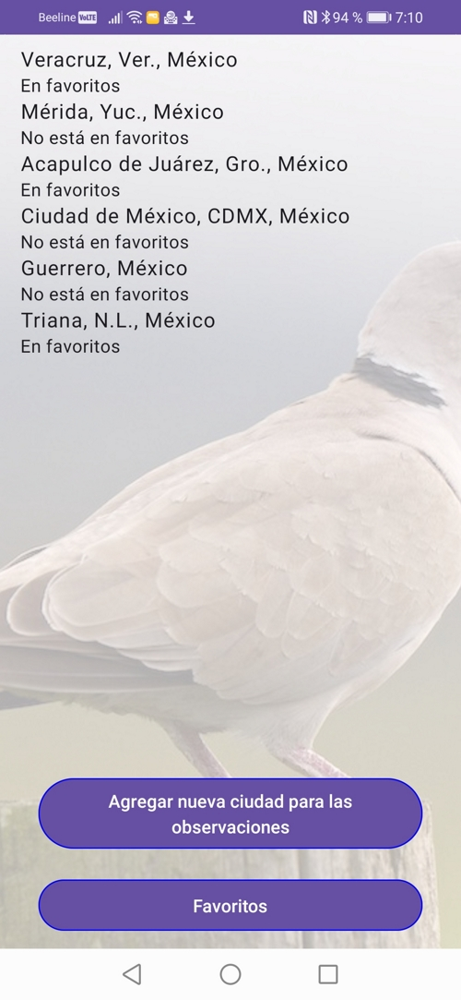

# Quetzalcoatl Sistemas tarea de prueba

#### Description
Tarea de prueba Android para Quetzalcóatl Sistemas. Usando los datos de servicio ornitológico de eBird para obtener y mostrar la información sobre las observaciones de aves en ciudades cual están guardado localmente en lista de usuario

#### Software Architecture
1. Usando arquitectura MVVM, la aplicación es completamente hecho en base de Jetpack Compose (sin usando comunes XML Layouts) y usa Material Design. Los coroutines de Kotlin Flow y Android Room para la persisténcia de datos son usados también
2. Usando Hilt, Retrofit2, RxJava
3. También está agregado cargando y presentación de las fotos en pantalla completa de las aves ubicadas en las ciudades de la lista de usuario en el fondo detrás, las fotos son descargadas desde Google Images

#### Instructions

1. El archivo res/raw/config.json contiene la configuración inicial cual contiene el API Key para eBird servicio y los API keys para servicio de busquedas de los imágenes de Google Images
2. Para borrar una ciudad desde lista o para cambiar su estado de favoritos es necesario a mover en su página de los detalles y pulsar las botones correspondientes ubicadas abajo en la pantalla

#### Important!

Las fotos de aves en el fondo son descargadas desde servicio de Google Images con limita hasta 100 solicitudes por día, y así estas fotos pueden parar cargando hasta día próximo si la aplicación está usado intensivamente

#### Screenshots

